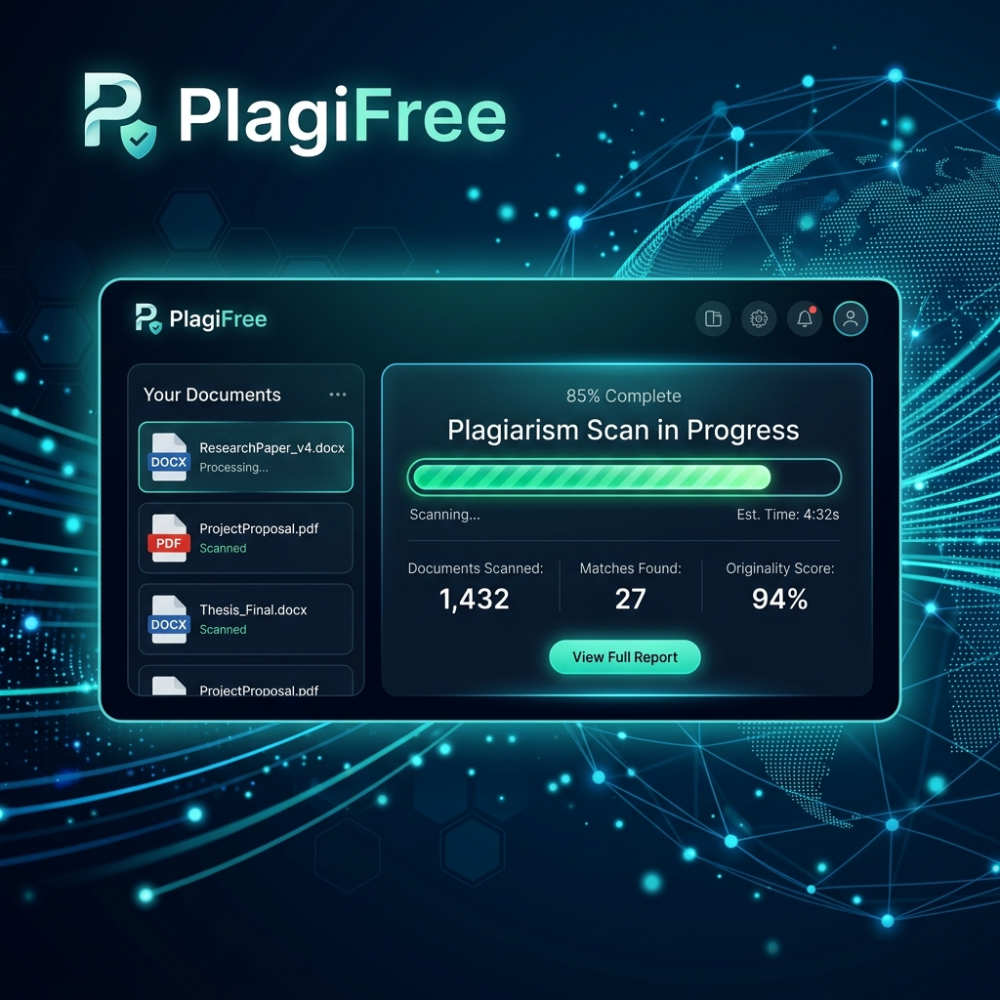
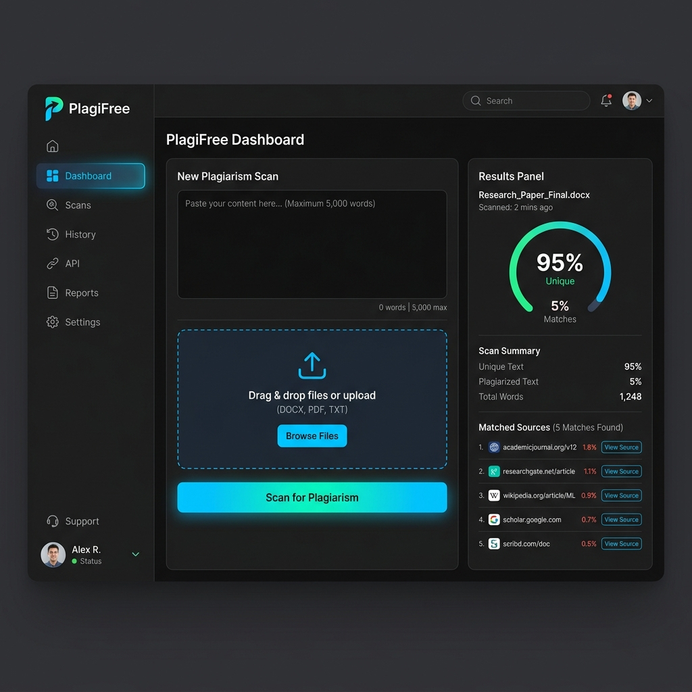

<p align="center">
  
</p>

<h1 align="center">🛡️ PlagiFree</h1>

<p align="center">
  <strong>The Ultimate Privacy-First, No-Login Plagiarism Checker</strong>
</p>

<p align="center">
  
  
  
  
  
  
</p>

---

## ✨ Overview

**PlagiFree** is a high-performance plagiarism detection system designed for users who value privacy and speed. Unlike traditional tools, PlagiFree requires **no signup, no login, and no credit cards**. Simply paste your text or upload a document, and get an instant, detailed report.

> [!TIP]
> 100% vibe coded for fun and built with a modern tech stack for lightning-fast results.

---

## 🚀 Features

- 📄 **Multi-Format Support**: Upload `.pdf`, `.docx`, or `.txt` files directly.
- ⚡ **Instant Scanning**: Gemini-grounded academic research for plagiarism checks.
- 🔒 **Privacy First**: No accounts, no data harvesting. Your documents are yours.
- 📊 **Detailed Reports**: Get a breakdown of unique vs. plagiarized content.
- 📥 **PDF Export**: Download professional reports with a single click using PDFKit.
- 💾 **Smart Caching**: MongoDB & Redis integration for blazing-fast subsequent checks.

---

## 📸 Preview

<p align="center">
  
</p>

---

## 🛠️ Tech Stack

- **Frontend**: [Next.js 15](https://nextjs.org/) (App Router), [Tailwind CSS](https://tailwindcss.com/), [Lucide React](https://lucide.dev/)
- **Backend**: [Express.js](https://expressjs.com/), [TypeScript](https://www.typescriptlang.org/)
- **Database**: [MongoDB](https://www.mongodb.com/) (Report Storage)
- **Caching**: [Redis](https://redis.io/) (Phrase & Page Lookup Caching)
- **Document Processing**: [Mammoth](https://www.npmjs.com/package/mammoth) (.docx), [pdf-parse](https://www.npmjs.com/package/pdf-parse) (.pdf)
- **Report Generation**: [PDFKit](https://pdfkit.org/)
- **AI Research**: [Google Gemini API](https://ai.google.dev/) with grounded Google Search

---

## ⚙️ Installation

Follow these steps to get your local instance up and running:

### 1. Clone the Repository
```bash
git clone https://github.com/your-username/plagifree.git
cd plagifree
```

### 2. Environment Setup
Copy the example environment file and fill in your credentials:
```bash
cp .env.example .env
```
Key variables needed:
- `GEMINI_API_KEY`: Your Google Gemini API key for grounded academic-source research.
- `GEMINI_MODEL`: Optional model override. Defaults to `gemini-2.5-flash`.
- `MONGODB_URI`: Your MongoDB connection string.
- `REDIS_URL`: Your Redis server URL.

### 3. Install Dependencies
```bash
npm install
```

### 4. Run Development Server
```bash
npm run dev
```
The application will be available at `http://localhost:3000` and the API at `http://localhost:5000`.

---

## 🛣️ API Routes

| Method | Route | Description |
| :--- | :--- | :--- |
| `GET` | `/` | Landing Page |
| `POST` | `/api/check` | Run plagiarism detection on text/files |
| `GET` | `/api/check/:id` | Fetch a saved report by ID |
| `GET` | `/api/report/:id` | Download a PDF version of the report |

---

## 📝 Important Notes

- **Fallback Mode**: If MongoDB or Redis are unavailable, the system automatically falls back to in-memory caching.
- **Search Engine**: Gemini is the only live search provider used by this app. If Gemini is unavailable or not configured, the scan now surfaces a warning instead of silently falling back to another provider.
- **Zero Auth**: This app is designed to be completely anonymous.

---

<p align="center">
  Built with ❤️ for the open-source community.
</p>
